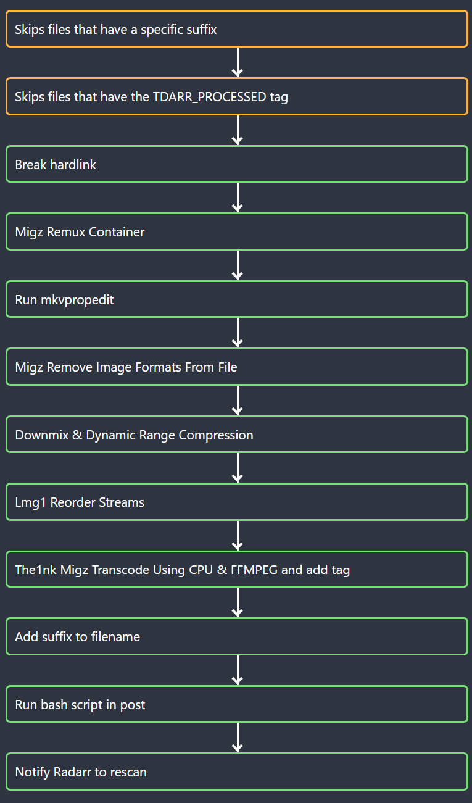

# Tdarr Plugins

Custom [Tdarr](https://home.tdarr.io/) plugins for automated media processing.

## Plugin Flow

The plugins are designed to work together in a pipeline. Orange-bordered steps are filter plugins that can short-circuit the stack; green-bordered steps are transcode/processing plugins.

| Step | Plugin |
|------|--------|
| 1 | Filename Suffix Filter — skip already-suffixed files |
| 2 | Processed Tag Filter — skip files with `TDARR_PROCESSED` tag |
| 3 | Break Hardlink |
| 4 | Migz Remux Container _(community plugin)_ |
| 5 | Run mkvpropedit |
| 6 | Migz Remove Image Formats From File _(community plugin)_ |
| 7 | Downmix to Stereo + DRC |
| 8 | Lmg1 Reorder Streams _(community plugin)_ |
| 9 | H265 CPU Transcode (writes `TDARR_PROCESSED` tag) |
| 10 | Add Suffix to Filename |
| 11 | Run Bash Script in Post |
| 12 | Notify Radarr to Rescan |

## Plugins

### Pre-processing / Filter

---

#### `Tdarr_Plugin_the1nk_filename_suffix_filter`
**Filename Suffix Filter** — v1.00

Skips the plugin stack if the filename ends with the specified suffix. Useful for preventing reprocessing of files that have already been handled.

| Input | Type | Default | Description |
|-------|------|---------|-------------|
| `suffix` | string | `(Tdarr)` | Suffix to look for in the filename |

---

#### `Tdarr_Plugin_the1nk_processed_tag_filter`
**Processed Tag Filter** — v1.00

Skips the plugin stack if the file has a `TDARR_PROCESSED` FFprobe metadata tag set. Pair this with a plugin that writes the tag to prevent files from being reprocessed on every Tdarr cycle.

No inputs.

---

### Pre-processing / Transcode

---

#### `Tdarr_Plugin_The1nk_MC93_Migz1FFMPEG_CPU`
**H265 CPU Transcode** — v1.9

Transcodes non-H265 files to H265 using libx265 on the CPU. Bitrate targets are derived dynamically from the source file's size and duration. VP9 files are skipped. Writes a `TDARR_PROCESSED` tag to prevent reprocessing on subsequent cycles.

| Input | Type | Default | Description |
|-------|------|---------|-------------|
| `container` | string | `mkv` | Output container: `mkv`, `mp4`, or `original` |
| `bitrate_cutoff` | string | _(empty)_ | Skip transcoding if bitrate is below this value (kbps) |
| `max_bitrate` | string | _(empty)_ | Re-transcode hevc/vp9 files whose video stream bitrate (ffprobe `BPS` tag) exceeds this value (kbps) |
| `enable_10bit` | boolean | `false` | Enable 10-bit output |
| `force_conform` | boolean | `false` | Drop non-conforming streams for the output container |

---

#### `Tdarr_Plugin_the1nk_downmix_to_stereo_and_apply_DRC`
**Downmix to Stereo + DRC** — v1.30

Processes audio tracks to improve playback on devices with limited dynamic range (e.g. TVs, phones):

- **Surround tracks (3+ channels):** Inserts a downmixed AAC stereo track *before* the original, with dynamic range compression and normalization applied.
- **Stereo/mono tracks:** Applies DRC and normalization in place.

Already-processed files are skipped via a `TDARR_DRC_PROCESSED` metadata tag.

| Input | Type | Default | Description |
|-------|------|---------|-------------|
| `drc_threshold` | string | `-20dB` | Compressor threshold; signals above this are compressed |
| `drc_ratio` | number | `4` | Compression ratio (e.g. `4` = 4:1) |
| `drc_attack` | number | `200` | Attack time in milliseconds |
| `drc_release` | number | `1000` | Release time in milliseconds |
| `drc_makeup` | number | `4` | Makeup gain in dB applied after compression |

---

#### `Tdarr_Plugin_the1nk_run_mkvpropedit`
**Run mkvpropedit** — v1.10

Runs `mkvpropedit` on MKV files to add track statistics tags (e.g. `BPS`, `DURATION`, `NUMBER_OF_FRAMES`). Non-MKV files are skipped. A `TDARR_MKVPROPEDIT` metadata tag is written via FFmpeg after processing to prevent the plugin from re-running on subsequent cycles.

No inputs.

---

#### `Tdarr_Plugin_the1nk_break_hardlink`
**Break Hardlink** — v1.00

Breaks filesystem hardlinks by copying the file to a temp path and atomically renaming it back. Run this before any plugin that modifies files in-place to ensure other hardlinked copies are not affected.

> **Note:** Relies on Linux `rename(2)` atomic-overwrite semantics. Will not work correctly on Windows.

No inputs.

---

### Post-processing

---

#### `Tdarr_Plugin_the1nk_add_suffix_to_filename`
**Add Suffix to Filename** — v1.00

Appends a configurable suffix to the output filename (e.g. `My Movie (Tdarr).mkv`). Skips files that already have the suffix. Trailing parenthetical groups are stripped before the suffix is added to avoid double-suffixing.

| Input | Type | Default | Description |
|-------|------|---------|-------------|
| `suffix` | string | `(Tdarr)` | Text to append to the filename |

---

#### `Tdarr_Plugin_the1nk_notify_radarr`
**Notify Radarr** — v1.00

Triggers a Radarr rescan after a movie file is processed. The plugin extracts the IMDB ID from the filename (requires Plex/Radarr naming convention, e.g. `Movie Title (2020) {imdb-tt1234567}.mkv`) and calls the Radarr API to rescan the matching movie.

| Input | Type | Default | Description |
|-------|------|---------|-------------|
| `host` | string | `localhost` | Radarr hostname or IP |
| `port` | string | `7878` | Radarr port |
| `apiKey` | string | _(empty)_ | Radarr API key (Settings → General → Security) |
| `useHttps` | boolean | `false` | Use HTTPS instead of HTTP |
| `baseUrl` | string | _(empty)_ | Base URL path for reverse proxy setups |

---

#### `Tdarr_Plugin_the1nk_notify_sonarr`
**Notify Sonarr** — v1.00

Triggers a Sonarr rescan after a TV episode is processed. The plugin extracts the IMDB ID from the show's folder name (e.g. `Show Name {imdb-tt1234567}`) and calls the Sonarr API to rescan the matching series.

| Input | Type | Default | Description |
|-------|------|---------|-------------|
| `host` | string | `localhost` | Sonarr hostname or IP |
| `port` | string | `8989` | Sonarr port |
| `apiKey` | string | _(empty)_ | Sonarr API key (Settings → General → Security) |
| `useHttps` | boolean | `false` | Use HTTPS instead of HTTP |
| `baseUrl` | string | _(empty)_ | Base URL path for reverse proxy setups |

---

#### `Tdarr_Plugin_the1nk_run_bash_script_in_post`
**Run Bash Script in Post** — v1.00

Executes an arbitrary bash script after processing. The file's working directory is passed as the first argument to the script. Stdout, stderr, and exit code are captured and logged to Tdarr.

| Input | Type | Default | Description |
|-------|------|---------|-------------|
| `script` | string | _(empty)_ | Absolute path to the bash script to execute |

---

## Deployment

See [`CLAUDE.md`](CLAUDE.md) for deployment instructions (push/pull scripts).
