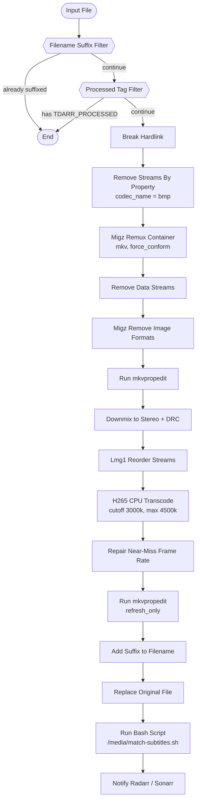

# Tdarr Plugins

Custom [Tdarr](https://home.tdarr.io/) plugins for automated media processing.

## Plugin Flow

The plugins run as Tdarr **Flows**, with each classic plugin wrapped in a "Run Classic Filter/Transcode Plugin" node. Exports of the flows live in this repo:

| File | Library | Notify step |
|------|---------|-------------|
| `flowMovies.json` | Movies | Radarr |
| `flowAnimovies.json` | Animovies | Radarr |
| `flowShows.json` | Shows | Sonarr |
| `flowAnishows.json` | Anishows | Sonarr |
| `flowOtherVideos.json` | Other Videos | _(none)_ |

The committed flows have their Radarr/Sonarr API keys replaced with `YOUR_RADARR_API_KEY` / `YOUR_SONARR_API_KEY`. Keep a copy with the real keys as `flow*.local.json` (gitignored) and import that one into Tdarr. When you change a flow, update both files.

All five share the same layout:

```mermaid
flowchart TD
    input([Input File]) --> f1{{Filename Suffix Filter}}
    f1 -- already suffixed --> stop([End])
    f1 -- continue --> f2{{Processed Tag Filter}}
    f2 -- has TDARR_PROCESSED --> stop
    f2 -- continue --> t1[Break Hardlink]
    t1 --> t2[Remove Streams By Property<br/>codec_name = bmp]
    t2 --> t3[Migz Remux Container<br/>mkv, force_conform]
    t3 --> t4[Remove Data Streams]
    t4 --> t5[Migz Remove Image Formats]
    t5 --> t6[Run mkvpropedit]
    t6 --> t7[Downmix to Stereo + DRC]
    t7 --> t8[Lmg1 Reorder Streams]
    t8 --> t9[H265 CPU Transcode<br/>cutoff 3000k, max 4500k]
    t9 --> t9b[Repair Near-Miss Frame Rate]
    t9b --> t9c[Run mkvpropedit<br/>refresh_only]
    t9c --> t10[Add Suffix to Filename]
    t10 --> replace[Replace Original File]
    replace --> p1[Run Bash Script<br/>/media/match-subtitles.sh]
    p1 --> p2[Notify Radarr / Sonarr]
```

Both outputs of every transcode node ("processed" / "not processed") lead to the next node. A filter's "skip" output is left unconnected, so the flow just ends and skipped files never trigger the script or a rescan.

### Ordering rules

- **Inside a flow, a classic plugin sees the current _working_ file.** After any FFmpeg step, that file is a temp copy in Tdarr's cache directory (`file._id` and `file.meta.Directory` point there), not the file in your library.
- **Repair Frame Rate goes _after_ H265 CPU Transcode.** It's the last step that touches video, so the repair can't be undone by a later FFmpeg pass.
- **mkvpropedit runs twice.** The first run, early in the flow, writes track statistics so the H265 step's `max_bitrate` check can read `BPS`. FFmpeg then copies those statistics unchanged onto the streams it re-encodes (DRC, x265), so a re-encoded video can claim its old H.264 bitrate. The second run (`refresh_only`) comes after the last step that changes the file and rewrites the statistics to match the final streams.
- **Add Suffix goes _before_ Replace Original File.** It renames the working file, and Replace Original File then puts it in the library folder under the new name, deleting the old one.
- **Bash Script and Notify go _after_ Replace Original File.** They need the final file in its real library folder. Before the replace step, the script would run in the cache directory, the Sonarr plugin wouldn't find the `{imdb-…}` show folder, and Radarr would rescan before the new file existed.
- **Break Hardlink comes before anything that can edit the original in place.** If no earlier step created a working copy, mkvpropedit edits the library file directly.

## Plugins

### Pre-processing / Filter

---

#### `Tdarr_Plugin_the1nk_filename_suffix_filter`
**Filename Suffix Filter** — v1.00

Skips the plugin stack if the filename ends with the specified suffix. Useful for preventing reprocessing of files that have already been handled.

| Input | Type | Default | Description |
|-------|------|---------|-------------|
| `suffix` | string | `(Tdarr)` | Suffix to look for in the filename |

---

#### `Tdarr_Plugin_the1nk_processed_tag_filter`
**Processed Tag Filter** — v1.00

Skips the plugin stack if the file has a `TDARR_PROCESSED` FFprobe metadata tag set. Pair this with a plugin that writes the tag to prevent files from being reprocessed on every Tdarr cycle.

No inputs.

---

### Pre-processing / Transcode

---

#### `Tdarr_Plugin_The1nk_MC93_Migz1FFMPEG_CPU`
**H265 CPU Transcode** — v1.9

Transcodes non-H265 files to H265 using libx265 on the CPU. Bitrate targets are derived dynamically from the source file's size and duration. VP9 files are skipped. Writes a `TDARR_PROCESSED` tag to prevent reprocessing on subsequent cycles.

| Input | Type | Default | Description |
|-------|------|---------|-------------|
| `container` | string | `mkv` | Output container: `mkv`, `mp4`, or `original` |
| `bitrate_cutoff` | string | _(empty)_ | Skip transcoding if bitrate is below this value (kbps) |
| `max_bitrate` | string | _(empty)_ | Re-transcode hevc/vp9 files whose video stream bitrate (ffprobe `BPS` tag) exceeds this value (kbps) |
| `enable_10bit` | boolean | `false` | Enable 10-bit output |
| `force_conform` | boolean | `false` | Drop non-conforming streams for the output container |

---

#### `Tdarr_Plugin_the1nk_downmix_to_stereo_and_apply_DRC`
**Downmix to Stereo + DRC** — v1.31

Processes audio tracks to improve playback on devices with limited dynamic range (e.g. TVs, phones):

- **Surround tracks (3+ channels):** Inserts a downmixed AAC stereo track *before* the original, with dynamic range compression and normalization applied.
- **Stereo/mono tracks:** Applies DRC and normalization in place.
- **Video, subtitles and attachments** (e.g. fonts for ASS subtitles) are stream-copied. Attachments are mapped last, because the Matroska muxer rejects an attachment mapped between other streams. Data streams are dropped.

Already-processed files are skipped via a `TDARR_DRC_PROCESSED` metadata tag.

| Input | Type | Default | Description |
|-------|------|---------|-------------|
| `drc_threshold` | string | `-20dB` | Compressor threshold; signals above this are compressed |
| `drc_ratio` | number | `4` | Compression ratio (e.g. `4` = 4:1) |
| `drc_attack` | number | `200` | Attack time in milliseconds |
| `drc_release` | number | `1000` | Release time in milliseconds |
| `drc_makeup` | number | `4` | Makeup gain in dB applied after compression |

---

#### `Tdarr_Plugin_the1nk_repair_framerate`
**Repair Near-Miss Frame Rate** — v1.00 _(flow-only)_

Fixes MKVs that stutter on the Fire TV 4K Max because their declared frame rate is a *near-miss* of a standard one (e.g. `23185/967`, `22178/925`, `21171/883`, all ≈23.976 but not exact). This is the flow version of `Repair-FrameRate.ps1` from the Movie framerate fixer scripts:

- **Gate:** MKV only, and the video rate must be non-standard but within `max_delta_fps` of a standard rate. Real odd rates like `500/21` or `1000/33` play fine and are left alone, because changing them would change playback speed.
- **Repair:** `mkvmerge --default-duration <track>:<nearest standard>p --fix-bitstream-timing-information <track>:1`. Streams are copied: no re-encode, and tags, attachments and chapters are kept.
- **Verify:** the rate must be corrected; codec, pixel format and video packet count must be unchanged; and duration must be within 1s. If any check fails, the repaired file is deleted and the original continues down the flow untouched.

The plugin runs mkvmerge itself and passes the repaired file to the next flow node by changing `file._id`, so it only works inside a flow. It finds `mkvmerge` next to `mkvpropedit`, and uses Tdarr's bundled ffprobe (`/app/Tdarr_Node/assets/app/ffmpeg/linux_x64/ffprobe`) or `ffprobe` on PATH. If mkvmerge can't be run, it logs that and skips the repair.

| Input | Type | Default | Description |
|-------|------|---------|-------------|
| `max_delta_fps` | number | `0.05` | Largest gap (fps) to the nearest standard rate that still counts as a near-miss |

---

#### `Tdarr_Plugin_the1nk_run_mkvpropedit`
**Run mkvpropedit** — v1.20

Runs `mkvpropedit` on MKV files to add track statistics tags (e.g. `BPS`, `DURATION`, `NUMBER_OF_FRAMES`). Non-MKV files are skipped. A `TDARR_MKVPROPEDIT` metadata tag is written via FFmpeg after processing to prevent the plugin from re-running on subsequent cycles.

With `refresh_only`, the plugin ignores the `TDARR_MKVPROPEDIT` tag, skips the FFmpeg pass, and just rewrites the statistics in place on the flow's working file. That fixes the stale values FFmpeg copies onto re-encoded streams. In this mode it skips the file if it is still the original library file, so library files are never edited in place.

| Input | Type | Default | Description |
|-------|------|---------|-------------|
| `refresh_only` | boolean | `false` | Only refresh the statistics in place (no tag check, no FFmpeg pass) |

---

#### `Tdarr_Plugin_the1nk_break_hardlink`
**Break Hardlink** — v1.00

Breaks filesystem hardlinks by copying the file to a temp path and atomically renaming it back. Run this before any plugin that modifies files in-place to ensure other hardlinked copies are not affected.

> **Note:** Relies on Linux `rename(2)` atomic-overwrite semantics. Will not work correctly on Windows.

No inputs.

---

### Post-processing

---

#### `Tdarr_Plugin_the1nk_add_suffix_to_filename`
**Add Suffix to Filename** — v1.00

Appends a configurable suffix to the output filename (e.g. `My Movie (Tdarr).mkv`) by renaming the current working file. Skips files that already have the suffix. A trailing empty `()` is stripped before the suffix is added. In a flow, put this **before** Replace Original File (see [Ordering rules](#ordering-rules)).

| Input | Type | Default | Description |
|-------|------|---------|-------------|
| `suffix` | string | `(Tdarr)` | Text to append to the filename |

---

#### `Tdarr_Plugin_the1nk_notify_radarr`
**Notify Radarr** — v1.00

Triggers a Radarr rescan after a movie file is processed. The plugin extracts the IMDB ID from the filename (requires Plex/Radarr naming convention, e.g. `Movie Title (2020) {imdb-tt1234567}.mkv`) and calls the Radarr API to rescan the matching movie. In a flow, put this **after** Replace Original File so Radarr finds the final file.

| Input | Type | Default | Description |
|-------|------|---------|-------------|
| `host` | string | `localhost` | Radarr hostname or IP |
| `port` | string | `7878` | Radarr port |
| `apiKey` | string | _(empty)_ | Radarr API key (Settings → General → Security) |
| `useHttps` | boolean | `false` | Use HTTPS instead of HTTP |
| `baseUrl` | string | _(empty)_ | Base URL path for reverse proxy setups |

---

#### `Tdarr_Plugin_the1nk_notify_sonarr`
**Notify Sonarr** — v1.00

Triggers a Sonarr rescan after a TV episode is processed. The plugin extracts the IMDB ID from the show's folder name (e.g. `Show Name {imdb-tt1234567}`) and calls the Sonarr API to rescan the matching series. In a flow, put this **after** Replace Original File, because before it the file is in the cache directory and there is no show folder in the path.

| Input | Type | Default | Description |
|-------|------|---------|-------------|
| `host` | string | `localhost` | Sonarr hostname or IP |
| `port` | string | `8989` | Sonarr port |
| `apiKey` | string | _(empty)_ | Sonarr API key (Settings → General → Security) |
| `useHttps` | boolean | `false` | Use HTTPS instead of HTTP |
| `baseUrl` | string | _(empty)_ | Base URL path for reverse proxy setups |

---

#### `Tdarr_Plugin_the1nk_run_bash_script_in_post`
**Run Bash Script in Post** — v1.00

Executes an arbitrary bash script after processing. The directory of the current file is passed as the first argument to the script. In a flow, put this **after** Replace Original File, or that directory is Tdarr's cache directory. Stdout, stderr, and exit code are captured and logged to Tdarr.

| Input | Type | Default | Description |
|-------|------|---------|-------------|
| `script` | string | _(empty)_ | Absolute path to the bash script to execute |

---

### Local copies of community plugins

These are unmodified community plugins kept in `Local` so the flows reference a fixed version:

| Plugin | Used for |
|--------|----------|
| `Tdarr_Plugin_00td_action_remove_stream_by_specified_property` | Drops `bmp` streams (`propertyToCheck=codec_name`, `valuesToRemove=bmp`) |
| `Tdarr_Plugin_MC93_Migz1Remux` | Remuxes to MKV with `force_conform` (drops data / `mov_text` / `eia_608` / `timed_id3`) |
| `Tdarr_Plugin_vdka_Remove_DataStreams` | Drops any remaining data streams |
| `Tdarr_Plugin_MP01_MichPasCleanSubsAndAudioCodecs` | _Not used by any flow_ |

`Tdarr_Plugin_MC93_MigzImageRemoval` and `Tdarr_Plugin_lmg1_Reorder_Streams` are used straight from the `Community` repo.

---

## Deployment

See [`CLAUDE.md`](CLAUDE.md) for deployment instructions (push/pull scripts).
